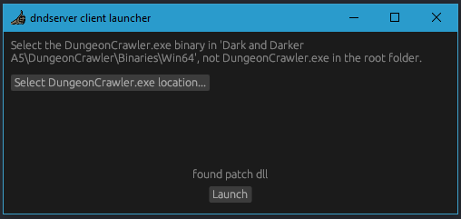

## About
Client launcher for Dark and Darker.

Current features:
`multiclient`

## Usage

[Download here](https://github.com/mfloob/dndserver-launcher/releases/tag/release-v1.0.1)

Select `Dark and Darker A5\DungeonCrawler\Binaries\Win64\DungeonCrawler.exe` from your client folder.

Press Launch

## Building

Install [rust](https://doc.rust-lang.org/cargo/getting-started/installation.html)

`rustup install nightly`

`git clone https://github.com/mfloob/dndserver-launcher.git`

`cd dndserver-launcher` and run `cargo +nightly build`

`cargo run`
